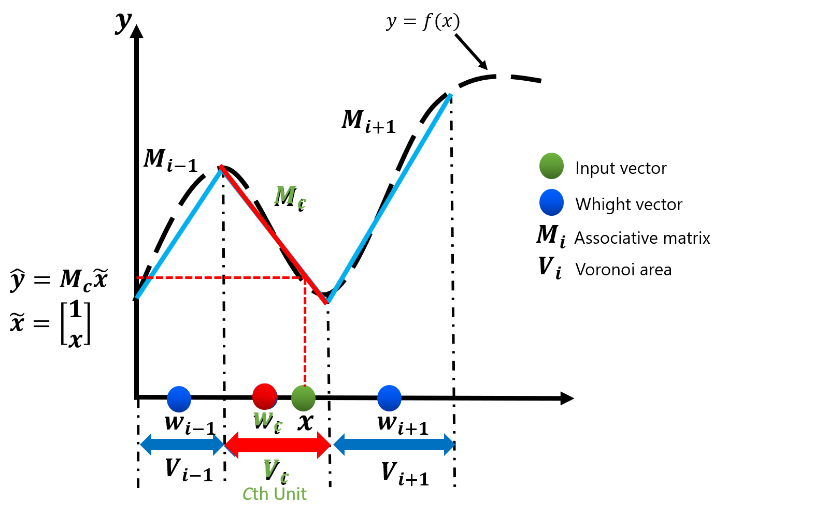

# CAN2
## Description
The competitive associative net CAN2 is a neural network that learns a nonlinear function using the functions of the competitive net<a href="#ref1">[1]</a> and the associative net<a href="#ref2">[2]</a> and approximates it as a piecewise-linear function.<br>
The effectiveness of this net has already been shown by applications to nonlinear time-varying plant control, estimation of recipitation, learning problem of nonlinear function and other problems. <br>

### Function approximation by CAN2
The diagram of function approximation by CAN2 is shown below.<br>
Suppose you want to learn a nonlinear function , as shown by the dashed line in the diagram.<br>


①The CAN2 divides the input area by weight vector. (The divided area is called the Voronoi area)<br>


②Each region has an associative matrix M, and linear approximation is performed using the associative matrix. <br>


③Given the input vector x, it looks for the weight vector wc that is closest to the input vector. <br>


④The prediction can be obtained by using the associative matrix Mc in this weight vector wc. <br>



Consider a system that inputs and outputs K-dimensional vectors  and scalar values 


## Requirements
### Compatible operating systems
The below list contains distribution versions with compatibility. However, it may work on other operating systems.
* Ubuntu 12.04 LTS
* Ubuntu 14.04 LTS
* Ubuntu 16.04 LTS
* Ubuntu 18.04 LTS
* Ubuntu 20.04 LTS

### System dependencies
* Python2.7
* Python3.8

## Installation
We installed the following software to operate the CAN2. However, it may work with other software. 

### Anaconda
```
$ cd ~/Downloads
$ wget https://repo.anaconda.com/archive/Anaconda3-2020.11-Linux-x86_64.sh
$ sh Anaconda3-2020.11-Linux-x86_64.sh
$ conda create --name py27 python=2.7 anaconda
$ conda create -n py27 python=2.7 anaconda
$ conda activate py27 (python2.7)
$ conda deactivate 　 (python3.8)
```

### Chainer
```
$ sudo apt install -y python3-pip
$ pip3 install cupy
$ pip3 install chainer
```

### OpenCV
```
$ conda install opencv
```

### Other software
```
$ sudo apt install -y gv
$ sudo apt install -y gnuplot
$ sudo apt install -y xterm
```

## Execution examples
Execution examples of regression and time-series IOS prediction by the single and bagging CAN2s are shown below. See [3], [4] and [5] for the details of regression, bagging, IOS prediction by CAN2, respectively. 

### 1. Set the root directory
```
$ export d0=$PWD;echo $d0 #set the root directory involving data, can2py, can2comp, etc.
```

### 2. Data preparation
- Regression data (Fig.1) : made by the following steps
```
$ cd ${d0}/can2py
$ export fn=Geo1d ntrain=100 restest=50 extest=10 k=1;
$ python makesamples.py -msd $fn,$ntrain,$restest,$extest
$ dst=${d0}/data/${fn}_${ntrain}_${restest}_${extest}
$ mkdir -p $dst
$ cp tmp/train.csv tmp/test.csv $dst
```

- Time-series data (Fig.2): see [5] for data creation via using GMP:${d0}/data/lorenz1e-8T0.025n10000p256m1_gmp.txt
Fig1 Fig2
 Fig1
 Fig.2
### 3. C program
- Regression
  - Single CAN2
```
$ cd $d0/can2comp;make
$ export fn=Geo1d ntrain=100 restest=50 extest=10 k=1;
$ export dst=${d0}/data/${fn}_${ntrain}_${restest}_${extest}
$ export fntrain=$dst/train.csv fntest=$dst/test.csv fnpred=predict+.dat
$ make data-clean;
$ export N=30 seed=0 k=1 T=100;
$ ensrs $fntrain -1:$fntest $N k:$k T:$T BIAS:1 Lstd:0:2 ib:0:0:0:0 vm2:-1 seed:$seed Tpinv:-1 nop:1 DISP:0
#(or) ensrs $fntrain 2:1:1:1 $N bg:$fntest k:$k T:$T BIAS:1 Lstd:0:2 ib:0:0:0:0 vm2:-1 seed:$seed Tpinv:-1 nop:1 export fntest=$fntest fnpred=./result-ensrs/tmp/train+test+s${s}0j0k${k}N${N}pred.dat;../sh/show${k}dpred.sh
```
#Results (see Fig.3) (smallest MSEtst=1.161e-05 (MSE for the test data) is achieved with N=30)
#100(0.030s) 7.274e-05 5.076e-04 #ep(time),MSEtr,MSEtst k1 n100:71 N20 s0
#100(0.033s) 6.660e-06 1.161e-05 #ep(time),MSEtr,MSEtst k1 n100:71 N30 s0 ***
#100(0.031s) 1.563e-05 3.368e-04 #ep(time),MSEtr,MSEtst k1 n100:71 N40 s0

  - Bagging CAN2 
```
$ cd $d0/can2comp;make
$ export N=50 a=2.2 b=100 seed=0 k=1 T=100;
$ make data-clean;
$ ensrs $fntrain 2:$b:$a:1 $N bg:$fntest k:$k T:$T BIAS:1 Lstd:0:2 ib:0:0:0:0 vm2:-1 seed:$seed Tpinv:-1 nop:1
$ export fntest=$fntest fnpred=predict+.dat;../sh/show${k}dpred.sh 
```
#Results (see Fig.4) (stably small MSE w.r.t. change of N)
#[100,-1](1.5s) 1.706e-05 #[T,Tpinv](time) n220,71 k1 N40 b100 a2.2 s0 nop1 m_cpu6
#[100,-1](1.6s) 1.186e-05 #[T,Tpinv](time) n220,71 k1 N50 b100 a2.2 s0 nop1 m_cpu6***
#[100,-1](1.8s) 1.616e-05 #[T,Tpinv](time) n220,71 k1 N60 b100 a2.2 s0 nop1 m_cpu6

Fig3 Fig4

- Time-series IOS prediction (IOS:iterated one-step ahead prediction) 
  - Single CAN2
```
$ cd $d0/can2comp;make
$ export fn=$d0/data/lorenz1e-8T0.025n10000p256m1_gmp.txt
$ export T=100 Tpinv=-1 k=8 N=50 seed=1 tp0=2000 tpD=1 Ey=15 a=1 b=1 nop=1 n_compare=6 v_thresh=0.2 vmin=3 vmin2=0 v_ratio=0.5 width=0.2 l_mode=1 gamma=1.4e-4 nentropy_thresh=0.7 n_display=5 rot_x=50 rot_y=350 y=-18.5:18.5:0:1
$ make data-clean;
$ ensrs $fn 2:${b}:${a}:${seed} $N-$N:1 t:0-2000:$tp0-$(($tp0+500)):$tpD:$Ey bg:/dev/null ib:0:0:0:0 k:$k g:$gamma w:$width T:$T vt:$v_thresh vr:$v_ratio lossall:1 DISP:2 y:$y x:$y nop:1 Tpinv:-1
#To see the result saved in tmp/pred2000-2500.dat, do
$ cat > tmp/y.plt <<EOF
$ set grid;set term png;set output "tmp/y.png";
$ plot "tmp/pred2000-2500.dat" using 2:1 w l t "yp", "" using 2:3 w l t "y", "" using 2:(\$1-\$3) w l t "err=yp-y"
$ EOF
gnuplot tmp/y.plt;eog tmp/y.png
```
#Results (see Fig.5)(H:predictable horison with the error threshold Ey=15)
#[100,-1](0.2s) #[T,Tinv] k8 N40 b1(nens1) a1 seed1 nop1 m_cpu6 0-2000:2000-2500:15H126
#[100,-1](0.3s) #[T,Tinv] k8 N50 b1(nens1) a1 seed1 nop1 m_cpu6 0-2000:2000-2500:15H153***
#[100,-1](0.3s) #[T,Tinv] k8 N60 b1(nens1) a1 seed1 nop1 m_cpu6 0-2000:2000-2500:15H24

  - Bagging CAN2
```
$ cd $d0/can2comp; make
$ export fn=$d0/data/lorenz1e-8T0.025n10000p256m1_gmp.txt
$ export T=100 Tpinv=-1 k=8 N=50 seed=1 tp0=2000 tpD=1 Ey=15 a=0.7 b=20 nop=1 n_compare=6 v_thresh=0.2 vmin=3 vmin2=0 v_ratio=0.5 width=0.2 l_mode=1 gamma=1.4e-4 nentropy_thresh=0.7 n_display=5 rot_x=50 rot_y=350 y=-18.5:18.5:0:1
$ make data-clean;
$ ensrs $fn 2:${b}:${a}:${seed} $N-$N:1 t:0-2000:$tp0-$(($tp0+500)):$tpD:$Ey bg:/dev/null ib:0:0:0:0 k:$k g:$gamma w:$width T:$T vt:$v_thresh vr:$v_ratio lossall:1 DISP:2 y:$y x:$y nop:1 Tpinv:-1
```
#Results (see Fig.6; longest predictable horizon H=224 is achieved with N=60)
#[100,-1](0.9s) #[T,Tinv] k8 N40 b20(nens1) a0.7 seed1 nop1 m_cpu6 0-2000:2000-2500:15H157
#[100,-1](1.0s) #[T,Tinv] k8 N50 b20(nens1) a0.7 seed1 nop1 m_cpu6 0-2000:2000-2500:15H224 ***
#[100,-1](1.3s) #[T,Tinv] k8 N60 b20(nens1) a0.7 seed1 nop1 m_cpu6 0-2000:2000-2500:15H199

Fig5 Fig6

### 4. Python program 
- Regression
  - Single CAN2
```
$ cd ${d0}/can2py
$ export fn=Geo1d ntrain=100 restest=50 extest=10 k=1;
$ export dst=${d0}/data/${fn}_${ntrain}_${restest}_${extest} export fntrain=$dst/train.csv fntest=$dst/test.csv fnpred=$dst/pred.csv
$ export T=100 N=100 k=1;
$ make data-clean
$ python can2.py -fn $fntrain,$fntest,$fnpred -k $k -in $N,6,0.2,3,0,0.5,0.2 -ex 1,0.05,2.2,$T,5,50,350 --gpu -1 -DISP 1 -nop 1
../sh/show${k}dpred.sh 
```
#Results (see Fig.7,Fig.8) (smallest MSE=2.627e-05 (for the test data) is achieved with N=100)
#100(1.050s) 7.310e-06 4.198e-05 #ep(time),MSEtr,MSE n100,71 k1 N90 T100,1000 seed0 nop1
#100(1.228s) 5.843e-06 2.627e-05 #ep(time),MSEtr,MSE n100,71 k1 N100 T100,1000 seed0 nop1
#100(1.249s) 5.843e-06 2.627e-05 #ep(time),MSEtr,MSE n100,71 k1 N110 T100,1000 seed0 nop1

  - Bagging CAN2
```
$ cd ${d0}/can2py
$ export T=100 N=50 k=1 Tpinv=-1 seed=1 m_cpu=0 b=100 a=2.2 nop=1
$ make data-clean
$ python ensrs.py -fn $fntrain,$fntest,$fnpred -k $k,0 -in $N,6,0.2,3,0,0.5,0.2 -ex 1,0.05,0.7,$T,5,50,350 -DISP 0 -Tpinv $Tpinv -s $seed -nop $nop -bag $b,$a,$seed,$m_cpu
$ ../sh/show${k}dpred.sh 
```
#Results (see Fig.9)
#[100,-1](53.1s) 3.052e-05 #[T,Tpinv] MSE n100,71 k1 N40 b100 a2.2 s1 m6 seed1 nop1
#[100,-1](55.5s) 2.105e-05 #[T,Tpinv] MSE n100,71 k1 N50 b100 a2.2 s1 m6 seed1 nop1***
#[100,-1](74.9s) 2.275e-05 #[T,Tpinv] MSE n100,71 k1 N60 b100 a2.2 s1 m6 seed1 nop1

Fig7 Fig8 Fig9

- Time-series IOS prediction 
  - Single CAN2 (try the following command with different seed=0,1,2,...) 
```
$ export T=100 Tpinv=-1 k=10 N=50 seed=2 tp0=2000 tpD=1 Ey=15 nop=1 n_compare=6 v_thresh=0.2 vmin=3 vmin2=0 v_ratio=0.5 width=0.2 l_mode=1 gamma0=0.05 nentropy_thresh=0.7 n_display=5 rot_x=50 rot_y=350 y=-18.5,18.5,0,1
$ export fn=$d0/data/lorenz1e-8T0.025n10000p256m1_gmp.txt
$ export fns=$d0/data/lorenz1e-8T0.025n10000p256m1_gmp+null+N50k10s${seed}.net
$ make data-clean
$ python can2.py -fn $fn -k $k -t 0-2000:$tp0-$(($tp0+500)):$tpD:$Ey -in $N,$n_compare,$v_thresh,$vmin,$vmin2,$v_ratio,$width -ex $l_mode,$gamma0,$nentropy_thresh,$T,$n_display,$rot_x,$rot_y --gpu -1 -DISP 1 -Tpinv $Tpinv -s $seed -nop $nop -y " $y" -fns $fns
```
#Results (see Fig.10,Fig.11)
#100(16.821s) 4.635e-05 1.238e-04 #ep(time),MSEtr,MSE n1990,500 k10 N50 T100,-1 seed0 nop1 t0-2000:2000-2500:1:15H22 predTime0.018s
#100(16.885s) 4.113e-05 1.174e-04 #ep(time),MSEtr,MSE n1990,500 k10 N50 T100,-1 seed1 nop1 t0-2000:2000-2500:1:15H194 predTime0.018s
#100(17.034s) 4.211e-05 1.293e-04 #ep(time),MSEtr,MSE n1990,500 k10 N50 T100,-1 seed2 nop1 t0-2000:2000-2500:1:15H101 predTime0.017s
...

  - Bagging CAN2
```
$ export T=100 Tpinv=-1 k=10 N=50 seed=10 b=20 a=1.0 tp0=2000 Ey=15 nop=1 n_compare=6 v_thresh=0.2 vmin=3 vmin2=0 v_ratio=0.5 width=0.2 l_mode=1 gamma0=0.05 nentropy_thresh=0.7 n_display=5 rot_x=50 rot_y=350 y=-18.5,18.5,0,1 m_cpu=0 fn=$d0/data/lorenz1e-8T0.025n10000p256m1_gmp.txt
$ make data-clean
$ python ensrs.py -fn $fn,,tmp/msp${tp0}.dat -k $k -t 0-2000:$tp0-$(($tp0+500)):1:$Ey -in $N,$n_compare,$v_thresh,$vmin,$vmin2,$v_ratio,$width -ex $l_mode,$gamma0,$nentropy_thresh,$T,$n_display,$rot_x,$rot_y --gpu -1 -DISP 0 -Tpinv $Tpinv -nop $nop -y " $y" -bag $b,$a,$seed,$m_cpu 
```
#Results (see Fig.12)
#[100,-1](226.9s) #[T,Tpinv] k10 N50 b20a1.0s10m6 nop1 t0-2000:2000-2500:1:15H159 seed0
#[100,-1](227.1s) #[T,Tpinv] k10 N50 b20a1.0s0m6 nop1 t0-2000:2000-2500:1:15H158 seed1

Fig10 Fig11 Fig12

### function approximation

```
export fn=Geo1d  ntrain=1000 restest=50 extest=10 k=1;python makesamples.py -msd $fn,$ntrain,$restest,$extest
```


## Notes
- Results of C and Python are different owing mainly to slightly different algorithms and parameters optimized for each language. 
- Execution time of C is smaller than Python. 
- Computational cost of the CAN2 is lower than many other machine learning methods mainly because it uses the learning scheme consisting of iterated steps of (a) local gradient descent optimization of two weight vectors near the input vector, (b) linear least squre optimization of a selected associative matrix, (c) reinitialization based on asymptotic optimality of error distortions avoiding local minimum (see [3]). 
- The CAN2 has advantages on (A) prediction accuracy in learning the functions with piecewise different smoothness (see [1]), (B) ability of extrapolation as well as interpolation (see [3]), (C) comutational cost, (D) extraction of piecewise linear predictive coefficients in the applications such as speech and speaker recognition (audio processing) and control (see [6],[7]). 

## References
<a id="ref1">[1]</a>A.C. Ahalt, A.K. Krishnamurthy, P. Chen and D.E. Melton: Competitive learning algorithms for vector quantization, Neural Networks, 3, 277/290 (1990)<br>
<a id="ref2">[2]</a>T. Kohonen: Associative Memory, Springer Verlag (1977)<br>
[3]S.Kurogi:Asymptotic optimality of competitive associative nets for their learning in function approximation. Proc. ICONIP2002, pp.507-511 (2002)<br>
(Detailed Journal: S.Kurogi: Asymptotic optimality of competitive associative nets and its Application to incremental learning of nonlinear functions, Systems and Communications in Japan, Vol.J86-D-II, No.2, pp.184-194 (2003))<br>
[4]S.Kurogi: Improving generalization performance via out-of-bag estimate using variable size of bags, J. Japanese Neural Network Society, Vol.J.16, No.2, pp.81-92 (2009)<br>
[5]D.Miyazaki, K.Matsuo, and S.Kurogi: Entropy of LOO Predictable Horizons to Select a Learning Machine and a Representative Prediction of Chaotic Time Series, ICONIP 2020, CCIS 1333, pp. 778-787 (2020)<br>
[6]T.Tagomori, R.Tsuruda, K.Matsuo, S.Kurogi: Speaker verification from mixture of speech and non-speech audio signals via using pole distribution of piecewise linear predictive coding coefficients, J Ambient Intell Human Comput (2020)<br>
https://doi.org/10.1007/s12652-020-01716-6<br>
[7] H.Nakayama, K.Ogi, K.Matsuo, and S.Kuro: Composition and Analysis of Pareto Optimal Compromise Solutions for Multiobjective Robust Controller Using GPC and CAN2s, ICONIP 2020, CCIS 1333, pp. 713-722, 2020.<br>
https://doi.org/10.1007/978-3-030-63823-8_81<br> 
