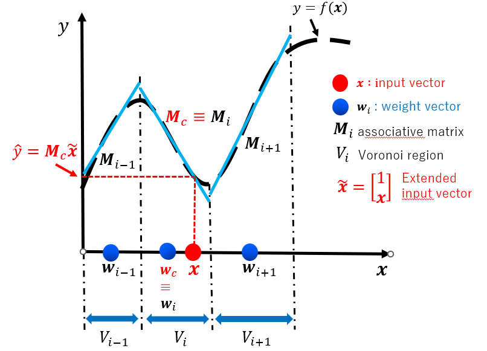

# CAN2 
Modified at 2023/6/21 by Shuichi Kurogi (kurogi.shuichi172@mail.kyutech.jp)
<hr>

##  1 Introduction
<!--## Description-->
  This repository provides C and Python code and execution examples of 
the competitive associative net called CAN2.
The CAN2 is a neural network for learning efficient piecewise linear approximation
of nonlinear functions.
It consists of weight vectors to divide the input space into Voronoi regions
and associative matrices to execute linear approximation in each Voronoi region.
We have developed a learning method consisting of
a gradient learning to optimize weight vectors,
an incremental least-squares to optimize associative matrices,
and a reinitialization based on asymptotic optimality
to avoide local minima of gradient method <a href="#ref1">[1]</a>, <a href="#ref2">[2]</a>, <a href="#ref3">[3]</a>.
 As a result, the CAN2 has achieved (a) a high accuracy and precision
 in approximation of nonlinear functions
 consisting of different smoothness from region to region,
 (b) a high interpolation and extrapolation ability,
 (c) a small computational cost,
 (d) an extraction of piecewise linear predictive coefficients
 useful in many engineering applications (see <a href="#ref4">[4]</a>-<a href="#ref10">[10]</a>).

  This page shows a brief explanation of
  the piecewise linear approximation by the CAN2 in 2,
  software requirements in 3, execution examples in 4, several remarks in 5, followed by references in 6.
## 2 Piecewise linear approximation by the CAN2


<!---->
<!---->

(1) For a target nonlinear function
 of
the input vector 
,
the CAN2 has weight vectors

for 
to divide the input space into Voronoi regions, 
and associative matrices 
 to execute linear approximation in each Voronoi region.

(2) For an input vector
,
the nearest weight vector

is selected, and the corresponding associative matrix

is used to obtain
 as a piecewise linear approximation of
, where the first element of

is for the bias of the linear approximation.

<hr>

## 3 Software Requirements
### 3.1 Operating system
<!--The present softwares shown below are executable in the following distribution versions.-->
* Ubuntu 20.04 LTS installed on Virtualbox as well as an external hard drive,
while Ubuntu 18.04 LTS, 16.04 LTS, 14.04 LTS, 12.04 LTS are sometimes used for comparison.

### 3.2 Version of C and Python
* icc version 2021.9.0 (gcc version 9.4.0 compatibility) (icc is about 3 times faster than gcc)
* Python2.7 (Python3.8 is invalid)

### 3.3 Utilities
<!--The following utilities are also used. -->

#### 3.3.1 Anaconda and OpenCV for Python
```
$ cd ~/Downloads
$ wget https://repo.anaconda.com/archive/Anaconda3-2020.11-Linux-x86_64.sh
$ sh Anaconda3-2020.11-Linux-x86_64.sh
$ conda create --name py27 python=2.7 anaconda
$ conda create -n py27 python=2.7 anaconda
$ conda activate py27 (python2.7)
$ conda deactivate 　 (deactivate python3.8)
$ conda install opencv #for install cv2
```

<!--
### Chainer (optional)
```
$ sudo apt install -y python3-pip
$ pip3 install cupy
$ pip3 install chainer
```
-->

<!--#### 3.3.2 OpenCV
```
$ conda install opencv #for install cv2
```
-->
#### 3.3.2 Other applications
```
$ sudo apt install -y gv
$ sudo apt install -y gnuplot
$ sudo apt install -y xterm
```

<!--### 3.3.4 Intel C compiler (icc) (about 3 times faster than gcc)-->

<hr>

## 4 Execution examples 
Execution examples of regression and time-series IOS prediction by the single and bagging CAN2s are shown below.
The details of regression, bagging, and IOS prediction by the CAN2 are shown in 
[[3]](#ref3), [[4]](#ref4) and [[5]](#ref5).
The following contents are also written in the html format: [./1021/docs/exec_examples.html](./1021/docs/exec_examples.html), where you can execute copy&paste easily.
<!--%For the reader's convenience,-->

### 4.1 Set the root directory
```
$ export d0=./0522 #set the root directory involving data, can2py, can2comp, etc. 
```

### 4.2 Data preparation
- Regression data ([Fig.1](./1021/docs/Geo1d_100_50_10.png)) : made by the following steps
```
$ cd ${d0}/can2py
$ export fn=Geo1d ntrain=100 restest=50 extest=10 k=1;
$ python makesamples.py -msd $fn,$ntrain,$restest,$extest
$ dst=${d0}/data/${fn}_${ntrain}_${restest}_${extest}
$ mkdir -p $dst
$ cp tmp/train.csv tmp/test.csv $dst
```

- Time-series data ([Fig.2](./1021/docs/lorenz1e-8T0.025n10000p256m1_gmp.png)): see [[5]](#ref5) for data creation via using GMP:${d0}/data/lorenz1e-8T0.025n10000p256m1_gmp.txt

 

<br>


 

### 4.3 C program
- Regression
  - Single CAN2
```
$ cd $d0/can2comp;make
$ export fn=Geo1d ntrain=100 restest=50 extest=10 k=1;
$ export dst=${d0}/data/${fn}_${ntrain}_${restest}_${extest}
$ export fntrain=$dst/train.csv fntest=$dst/test.csv fnpred=predict+.dat
$ make data-clean;
$ export N=30 seed=0 k=1 T=100;
$ ensrs $fntrain -1:$fntest $N k:$k T:$T BIAS:1 Lstd:0:2 ib:0:0:0:0 vm2:-1 seed:$seed Tpinv:-1 nop:1 DISP:0
#(or) ensrs $fntrain 2:1:1:1 $N bg:$fntest k:$k T:$T BIAS:1 Lstd:0:2 ib:0:0:0:0 vm2:-1 seed:$seed Tpinv:-1 nop:1 export fntest=$fntest fnpred=./result-ensrs/tmp/train+test+s${s}0j0k${k}N${N}pred.dat;../sh/show${k}dpred.sh
```
#Results (see [Fig.3](./1021/docs/regression-singleCAN2N30s0.jpg) (smallest MSEtst=1.161e-05 (MSE for the test data) is achieved with N=30)<br>
#100(0.030s) 7.274e-05 5.076e-04 #ep(time),MSEtr,MSEtst k1 n100:71 N20 s0<br>
#100(0.033s) 6.660e-06 1.161e-05 #ep(time),MSEtr,MSEtst k1 n100:71 N30 s0 ***<br>
#100(0.031s) 1.563e-05 3.368e-04 #ep(time),MSEtr,MSEtst k1 n100:71 N40 s0<br>

  - Bagging CAN2 
```
$ cd $d0/can2comp;make
$ export N=50 a=2.2 b=100 seed=0 k=1 T=100;
$ make data-clean;
$ ensrs $fntrain 2:$b:$a:1 $N bg:$fntest k:$k T:$T BIAS:1 Lstd:0:2 ib:0:0:0:0 vm2:-1 seed:$seed Tpinv:-1 nop:1
$ export fntest=$fntest fnpred=predict+.dat;../sh/show${k}dpred.sh 
```
#Results (see [Fig.4](./1021/docs/regression-baggingCAN2N50a2.2s0.jpg) (stably small MSE w.r.t. change of N)<br>
#\[100,-1\](1.5s) 1.706e-05 #\[T,Tpinv\](time) n220,71 k1 N40 b100 a2.2 s0 nop1 m_cpu6<br>
#\[100,-1\](1.6s) 1.186e-05 #\[T,Tpinv\](time) n220,71 k1 N50 b100 a2.2 s0 nop1 m_cpu6***<br>
#\[100,-1\](1.8s) 1.616e-05 #\[T,Tpinv\](time) n220,71 k1 N60 b100 a2.2 s0 nop1 m_cpu6<br>

 Fig.3
 Fig.4


  - OOB(out-of-bag) estimate (see [[4]](#ref4)):To obtain the above parameters a=2.2 and N=40  without test data
```
export fntrains=$dst/trains.csv
sort -g -k 1 $fntrain > $fntrains  #To display the result shown below
make data-clean
export N=50 a=2.2 b=300 seed=1 k=1 T=100; #Obtain optimal a and N by trial and ePCrror
ensrs $fntrains 2:$b:$a:$seed $N bg:/dev/null k:$k T:$T BIAS:1 Lstd:0:2 ib:0:0:0:0 vm2:-1 Tpinv:-1 nop:1 
export fntest=$fntrains fnpred=predict+oob.dat;../sh/show${k}dpred.sh #Display the result
```
#Results of oob estimate for fntrain=$d0/data/Geo1d_100_50_10/train.csv<br>
#a=2.2 (Do not care about "inf H-nan" below<br>
#Ltst(n10.6*100)2.443e-05 Lib(n89.4*100)inf H-nan, nTest10.6=11.1=exp(-2.20)*nGiven100method:2:100:2.2:1N30.<br>
#Ltst(n10.6*100)2.287e-05 Lib(n89.4*100)inf H-nan, nTest10.6=11.1=exp(-2.20)*nGiven100method:2:100:2.2:1N40.***(2.287e-05)<br>
#Ltst(n32.0*100)2.413e-05 Lib(n267.9*100)1.660e-01 H7.086e-01, nTest10.7=11.1=exp(-2.20)*nGiven100method:2:300:2.2:1N50.<br>
#a=2.3<br>
#Ltst(n9.7*100)6.488e-05 Lib(n90.3*100)inf H-nan, nTest9.7=10.0=exp(-2.30)*nGiven100method:2:100:2.3:0N40.<br>
#Ltst(n9.7*100)4.635e-05 Lib(n90.3*100)inf H-nan, nTest9.7=10.0=exp(-2.30)*nGiven100method:2:100:2.3:0N50.<br>
#Ltst(n9.7*100)5.402e-05 Lib(n90.3*100)inf H-nan, nTest9.7=10.0=exp(-2.30)*nGiven100method:2:100:2.3:0N60.<br>
#a=2.1<br>
#Ltst(n11.9*100)4.721e-05 Lib(n88.1*100)inf H-nan, nTest11.9=12.2=exp(-2.10)*nGiven100method:2:100:2.1:1N40.<br>
#Ltst(n11.9*100)3.921e-05 Lib(n88.1*100)inf H-nan, nTest11.9=12.2=exp(-2.10)*nGiven100method:2:100:2.1:1N50.<br>
#Ltst(n11.9*100)5.038e-05 Lib(n88.1*100)inf H-nan, nTest11.9=12.2=exp(-2.10)*nGiven100method:2:100:2.1:1N60.<br>
#Additional results of oob estimate for fntrain=$d0/data/Geo1d_1000_50_10/train.csv<br>
#Ltst(n222.2*1000)2.805e-07 Lib(n77.8*1000)2.920e-01 H8.634e-01, nTest740.7=740.8=exp(-0.30)*nGiven1000method:2:300:0.3:1N50.<br>
#Ltst(n149.0*1000)9.212e-08 Lib(n151.0*1000)2.920e-01 H8.657e-01, nTest496.5=496.6=exp(-0.70)*nGiven1000method:2:300:0.7:1N50. 2-fold CV<br>
#Ltst(n110.4*1000)8.835e-08 Lib(n189.6*1000)2.920e-01 H8.660e-01, nTest368.1=367.9=exp(-1.00)*nGiven1000method:2:300:1.0:1N50. .632 bootstrap<br>
#Ltst(n60.7*1000)8.224e-08 Lib(n239.3*1000)2.920e-01 H8.662e-01, nTest202.2=201.9=exp(-1.60)*nGiven1000method:2:300:1.6:1N50.*** 5-fold CV<br>
#Ltst(n30.1*1000)1.020e-07 Lib(n269.9*1000)2.920e-01 H8.663e-01, nTest100.2=100.3=exp(-2.30)*nGiven1000method:2:300:2.3:1N50. 10-fold CV<br>
#####<br>
#Additional results of oob estimate for $d0/data/Geo1d_5000_50_10/train.csv<br>
#Ltst(n222.2*5000)2.354e-08 Lib(n77.8*5000)2.831e-01 H8.853e-01, nTest3703.9=3704.1=exp(-0.30)*nGiven5000method:2:300:0.3:1N50.<br>
#Ltst(n149.0*5000)2.300e-08 Lib(n151.0*5000)2.831e-01 H8.872e-01, nTest2482.6=2482.9=exp(-0.70)*nGiven5000method:2:300:0.7:1N50. 2-fold CV<br>
#Ltst(n110.3*5000)2.256e-08 Lib(n189.7*5000)2.831e-01 H8.873e-01, nTest1838.7=1839.4=exp(-1.00)*nGiven5000method:2:300:1.0:1N50.***a=1.0 oob best for ntest5000<br>
#Ltst(n60.6*5000)2.667e-08 Lib(n239.4*5000)2.831e-01 H8.877e-01, nTest1010.6=1009.5=exp(-1.60)*nGiven5000method:2:300:1.6:1N50. 5-fold CV<br>
#Ltst(n30.2*5000)3.960e-08 Lib(n269.8*5000)2.831e-01 H8.878e-01, nTest503.5=501.3=exp(-2.30)*nGiven5000method:2:300:2.3:1N50.  10-fold CV<br>


- Time-series IOS prediction (IOS:iterated one-step ahead prediction) 
  - Single CAN2
```
$ cd $d0/can2comp;make
$ export fn=$d0/data/lorenz1e-8T0.025n10000p256m1_gmp.txt
$ export T=100 Tpinv=-1 k=8 N=50 seed=1 tp0=2000 tpD=1 Ey=15 a=1 b=1 nop=1 n_compare=6 v_thresh=0.2 vmin=3 vmin2=0 v_ratio=0.5 width=0.2 l_mode=1 gamma=1.4e-4 nentropy_thresh=0.7 n_display=5 rot_x=50 rot_y=350 y=-18.5:18.5:0:1
$ make data-clean;
$ ensrs $fn 2:${b}:${a}:${seed} $N-$N:1 t:0-2000:$tp0-$(($tp0+500)):$tpD:$Ey bg:/dev/null ib:0:0:0:0 k:$k g:$gamma w:$width T:$T vt:$v_thresh vr:$v_ratio lossall:1 DISP:2 y:$y x:$y nop:1 Tpinv:-1
#To see the result saved in tmp/pred2000-2500.dat, do
$ cat > tmp/y.plt <<EOF
$ set grid;set term png;set output "tmp/y.png";
$ plot "tmp/pred2000-2500.dat" using 2:1 w l t "yp", "" using 2:3 w l t "y", "" using 2:(\$1-\$3) w l t "err=yp-y"
$ EOF
gnuplot tmp/y.plt;eog tmp/y.png
```
#Results (see [Fig.5](./1021/docs/IOSpred-singleCAN2cN50s1-y.png)(H:predictable horison with the error threshold Ey=15)<br>
#\[100,-1\](0.2s) #[T,Tinv] k8 N40 b1(nens1) a1 seed1 nop1 m_cpu6 0-2000:2000-2500:15H126<br>
#\[100,-1\](0.3s) #[T,Tinv] k8 N50 b1(nens1) a1 seed1 nop1 m_cpu6 0-2000:2000-2500:15H153***<br>
#\[100,-1\](0.3s) #[T,Tinv] k8 N60 b1(nens1) a1 seed1 nop1 m_cpu6 0-2000:2000-2500:15H24<br>

  - Bagging CAN2
```
$ cd $d0/can2comp; make
$ export fn=$d0/data/lorenz1e-8T0.025n10000p256m1_gmp.txt
$ export T=100 Tpinv=-1 k=8 N=50 seed=1 tp0=2000 tpD=1 Ey=15 a=0.7 b=20 nop=1 n_compare=6 v_thresh=0.2 vmin=3 vmin2=0 v_ratio=0.5 width=0.2 l_mode=1 gamma=1.4e-4 nentropy_thresh=0.7 n_display=5 rot_x=50 rot_y=350 y=-18.5:18.5:0:1
$ make data-clean;
$ ensrs $fn 2:${b}:${a}:${seed} $N-$N:1 t:0-2000:$tp0-$(($tp0+500)):$tpD:$Ey bg:/dev/null ib:0:0:0:0 k:$k g:$gamma w:$width T:$T vt:$v_thresh vr:$v_ratio lossall:1 DISP:2 y:$y x:$y nop:1 Tpinv:-1
```
#Results (see [Fig.6](./1021/docs/IOSpred-baggingCAN2cN50a0.7b20s1-y.png); longest predictable horizon H=224 is achieved with N=60)<br>
#\[100,-1\](0.9s) #[T,Tinv] k8 N40 b20(nens1) a0.7 seed1 nop1 m_cpu6 0-2000:2000-2500:15H157<br>
#\[100,-1\](1.0s) #[T,Tinv] k8 N50 b20(nens1) a0.7 seed1 nop1 m_cpu6 0-2000:2000-2500:15H224 ***<br>
#\[100,-1\](1.3s) #[T,Tinv] k8 N60 b20(nens1) a0.7 seed1 nop1 m_cpu6 0-2000:2000-2500:15H199<br>

 Fig.5
 Fig.6

### 4.4 Python program 
- Regression
  - Single CAN2
```
$ cd ${d0}/can2py
$ export fn=Geo1d ntrain=100 restest=50 extest=10 k=1;
$ export dst=${d0}/data/${fn}_${ntrain}_${restest}_${extest} export fntrain=$dst/train.csv fntest=$dst/test.csv fnpred=$dst/pred.csv
$ export T=100 N=100 k=1;
$ make data-clean
$ python can2.py -fn $fntrain,$fntest,$fnpred -k $k -in $N,6,0.2,3,0,0.5,0.2 -ex 1,0.05,2.2,$T,5,50,350 --gpu -1 -DISP 1 -nop 1
../sh/show${k}dpred.sh 
```
#Results (see [Fig.7](./1021/docs/regression-singleCAN2pyN100s0-mse.jpg),[Fig.8](./1021/docs/regression-singleCAN2pyN100s0.jpg)) (smallest MSE=2.627e-05 (for the test data) is achieved with N=100)<br>
#100(1.050s) 7.310e-06 4.198e-05 #ep(time),MSEtr,MSE n100,71 k1 N90 T100,1000 seed0 nop1<br>
#100(1.228s) 5.843e-06 2.627e-05 #ep(time),MSEtr,MSE n100,71 k1 N100 T100,1000 seed0 nop1<br>
#100(1.249s) 5.843e-06 2.627e-05 #ep(time),MSEtr,MSE n100,71 k1 N110 T100,1000 seed0 nop1<br>

  - Bagging CAN2
```
$ cd ${d0}/can2py
$ export T=100 N=50 k=1 Tpinv=-1 seed=1 m_cpu=0 b=100 a=2.2 nop=1
$ make data-clean
$ python ensrs.py -fn $fntrain,$fntest,$fnpred -k $k,0 -in $N,6,0.2,3,0,0.5,0.2 -ex 1,0.05,0.7,$T,5,50,350 -DISP 0 -Tpinv $Tpinv -s $seed -nop $nop -bag $b,$a,$seed,$m_cpu
$ ../sh/show${k}dpred.sh 
```
#Results (see [Fig.9](./1021/docs/regression-baggingCAN2pyN60a2.2b100s1.jpg))<br>
#\[100,-1\](53.1s) 3.052e-05 #\[T,Tpinv\] MSE n100,71 k1 N40 b100 a2.2 s1 m6 seed1 nop1<br>
#\[100,-1\](55.5s) 2.105e-05 #\[T,Tpinv\] MSE n100,71 k1 N50 b100 a2.2 s1 m6 seed1 nop1***
#\[100,-1\](74.9s) 2.275e-05 #\[T,Tpinv\] MSE n100,71 k1 N60 b100 a2.2 s1 m6 seed1 nop1<br>

 Fig.7
 Fig.8
 Fig.9

- Time-series IOS prediction 
  - Single CAN2 (try the following command with different seed=0,1,2,...) 
```
$ export T=100 Tpinv=-1 k=10 N=50 seed=2 tp0=2000 tpD=1 Ey=15 nop=1 n_compare=6 v_thresh=0.2 vmin=3 vmin2=0 v_ratio=0.5 width=0.2 l_mode=1 gamma0=0.05 nentropy_thresh=0.7 n_display=5 rot_x=50 rot_y=350 y=-18.5,18.5,0,1
$ export fn=$d0/data/lorenz1e-8T0.025n10000p256m1_gmp.txt
$ export fns=$d0/data/lorenz1e-8T0.025n10000p256m1_gmp+null+N50k10s${seed}.net
$ make data-clean
$ python can2.py -fn $fn -k $k -t 0-2000:$tp0-$(($tp0+500)):$tpD:$Ey -in $N,$n_compare,$v_thresh,$vmin,$vmin2,$v_ratio,$width -ex $l_mode,$gamma0,$nentropy_thresh,$T,$n_display,$rot_x,$rot_y --gpu -1 -DISP 1 -Tpinv $Tpinv -s $seed -nop $nop -y " $y" -fns $fns
```
#Results (see [Fig.10](./1021/docs/IOSpred-singleCAN2pyN50s2-mse.jpg),[Fig.11](./1021/docs/IOSpred-singleCAN2pyN50s2-y.jpg))<br>
#100(16.821s) 4.635e-05 1.238e-04 #ep(time),MSEtr,MSE n1990,500 k10 N50 T100,-1 seed0 nop1 t0-2000:2000-2500:1:15H22 predTime0.018s<br>
#100(16.885s) 4.113e-05 1.174e-04 #ep(time),MSEtr,MSE n1990,500 k10 N50 T100,-1 seed1 nop1 t0-2000:2000-2500:1:15H194 predTime0.018s<br>
#100(17.034s) 4.211e-05 1.293e-04 #ep(time),MSEtr,MSE n1990,500 k10 N50 T100,-1 seed2 nop1 t0-2000:2000-2500:1:15H101 predTime0.017s<br>
...

  - Bagging CAN2
```
$ export T=100 Tpinv=-1 k=10 N=50 seed=10 b=20 a=1.0 tp0=2000 Ey=15 nop=1 n_compare=6 v_thresh=0.2 vmin=3 vmin2=0 v_ratio=0.5 width=0.2 l_mode=1 gamma0=0.05 nentropy_thresh=0.7 n_display=5 rot_x=50 rot_y=350 y=-18.5,18.5,0,1 m_cpu=0 fn=$d0/data/lorenz1e-8T0.025n10000p256m1_gmp.txt
$ make data-clean
$ python ensrs.py -fn $fn,,tmp/msp${tp0}.dat -k $k -t 0-2000:$tp0-$(($tp0+500)):1:$Ey -in $N,$n_compare,$v_thresh,$vmin,$vmin2,$v_ratio,$width -ex $l_mode,$gamma0,$nentropy_thresh,$T,$n_display,$rot_x,$rot_y --gpu -1 -DISP 0 -Tpinv $Tpinv -nop $nop -y " $y" -bag $b,$a,$seed,$m_cpu 
```
#Results (see [Fig.12](./1021/docs/IOSpred-baggingCAN2pyN50a1b20s10-y.jpg))<br>
#\[100,-1\](226.9s) #\[T,Tpinv\] k10 N50 b20a1.0s10m6 nop1 t0-2000:2000-2500:1:15H159 seed0<br>
#\[100,-1\](227.1s) #\[T,Tpinv\] k10 N50 b20a1.0s0m6 nop1 t0-2000:2000-2500:1:15H158 seed1<br>

 Fig.10
 Fig.11
 Fig.12

## 5 Remarks
- Results of C and Python are different owing mainly to slightly different algorithms and parameters optimized for each language. 
- Execution time of C is smaller than Python. 
- Computational cost of the CAN2 is lower than many other machine learning methods mainly because it uses the learning scheme consisting of iterated steps of (a) local gradient descent optimization of two weight vectors near the input vector, (b) linear least squre optimization of a selected associative matrix, (c) reinitialization based on asymptotic optimality of error distortions avoiding local minimum (see [[3]](#ref3)). 
- The CAN2 has advantages on (A) prediction accuracy in learning the functions with piecewise different smoothness (see [[3]](#ref3)), (B) ability of extrapolation as well as interpolation (see [3]), (C) comutational cost, (D) extraction of piecewise linear predictive coefficients in the applications such as speech and speaker recognition (audio processing) and control (see [[6]](#ref6),[[7]](#ref7)). 

## 6 References
<a id="ref1">[1]</a> S.Kurogi:Asymptotic optimality of competitive associative nets for their learning in function approximation. Proc. ICONIP2002, pp.507-511 (2002)  https://doi.org/10.1002/scj.10538<br>
(Detailed Journal: S.Kurogi: Asymptotic optimality of competitive associative nets and its Application to incremental learning of nonlinear functions, Systems and Communications in Japan, Vol.J86-D-II, No.2, pp.184-194 (2003))<br>

<a id="ref2">[2]</a> A.C. Ahalt, A.K. Krishnamurthy, P. Chen and D.E. Melton: Competitive learning algorithms for vector quantization, Neural Networks, 3, 277/290 (1990)<br>

<a id="ref3">[3]</a> T. Kohonen: Associative Memory, Springer Verlag (1977)<br>

<a id="ref4">[4]</a> S.Kurogi: Improving generalization performance via out-of-bag estimate using variable size of bags, J. Japanese Neural Network Society, Vol.J.16, No.2, pp.81-92 (2009) http://doi.org/10.3902/jnns.16.81<br>
(An application written in English)
      S.Kurogi, R.Shigematsu, and K.Ono: Properties of Direct Multi-Step Ahead Prediction of Chaos Time Series and Out-of-Bag Estimate for Model selection 
      ICONIP2014, Part II, LNCS8835, pp. 421-428 (2014) https://doi.org/10.1007/978-3-319-12640-1_51 <br>

<a id="ref5">[5]</a> D.Miyazaki, K.Matsuo, and S.Kurogi: Entropy of LOO Predictable Horizons to Select a Learning Machine and a Representative Prediction of Chaotic Time Series, ICONIP 2020, CCIS 1333, pp. 778-787 (2020) https://doi.org/10.1007/978-3-030-63823-8_88

<a id="ref6">[6]</a> T.Tagomori, R.Tsuruda, K.Matsuo, S.Kurogi: Speaker verification from mixture of speech and non-speech audio signals via using pole distribution of piecewise linear predictive coding coefficients, J Ambient Intell Human Comput (2020) https://doi.org/10.1007/s12652-020-01716-6<br>

<a id="ref7">[7]</a> H.Nakayama, K.Ogi, K.Matsuo, and S.Kuro: Composition and Analysis of Pareto Optimal Compromise Solutions for Multiobjective Robust Controller Using GPC and CAN2s, ICONIP 2020, CCIS 1333, pp. 713-722, 2020. https://doi.org/10.1007/978-3-030-63823-8_81<br> 

<a id="ref8">[8]</a> K.Taniguchi, S.Kurogi:Performance Improvement of a Method Using Entropy of LOO Predictable Horizons to Select a Representative Prediction of Chaotic Time Series, Proceedings of IEEE-CSDE 2022 (2022/12/19)

<a id="ref9">[9]</a> K.Komatsu, S.Oyabu, S.Kurogi: Performance Improvement and Analysis of a Method for Piano Authentication from Audio Signal by Combining Feature Vectors of LPC Spectral Envelope, MFCC, and pLPC Pole Distribution, 
Proceedings of IEEE-CSDE 2022 (2022/12/19) (Best Paper Award)

<a id="ref10">[10]</a> K.Komatsu, S.Kurogi: Performance Improvement for Speaker Detection from Mixed Speech of Multiple Speakers Using Probabilistic Prediction and Combining LPCSE, MFCC and pLPCPD, 
Proceedings of IEEE-CSDE 2022 (2022/12/19) 

<!--
### function approximation

```
export fn=Geo1d  ntrain=1000 restest=50 extest=10 k=1;python makesamples.py -msd $fn,$ntrain,$restest,$extest
```


-->